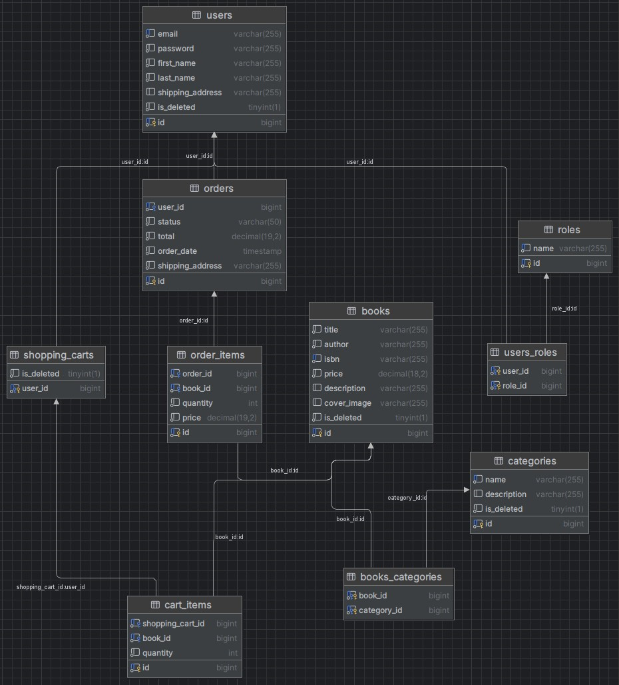

# 📚 Online Bookstore
An enterprise-grade RESTful API built for an online bookstore application. 
This project provides a robust backend solution for managing book inventories, 
user shopping carts, order processing, and role-based access control.

## 🛠️ Technologies Stack

* **Java:** Java (jbr-17.0.11 JetBrains)
* **Framework:** Spring Framework (Web, Security, Validation, Data-jpa) (v3.4.3)
* **Database:** MySQL (v0.0.32)
* **Database Migration:** Liquibase (v4.29.2)
* **Boilerplate Reduction:** Lombok (v1.18.36)
* **Object Mapping:** MapStruct (v1.6.3)
* **Build Tool:** Maven (v3.3.0)
* **Authentication:** JWT (v0.12.5)
* **Testing:** Junit (v3.0.0+), Mockito
* **API Documentation:** Swagger (v2.7.0)
* **Containerization:** Docker (v28.0.4)
* **Cloud & OS:** AWS, Linux


## 📝 Architecture Overview

* This application follows a **Layered Architecture** pattern:
* **Controller Layer:** Exposes RESTful endpoints and handles HTTP requests/responses.
* **Service Layer:** Contains core business logic and mediates between controllers and repositories.
* **Repository Layer:** Interacts with the database using Spring Data JPA.
* **Model Layer:** Defines domain entities to be saved in the database.
* **DTO Layer:** Transfers data between different parts of an application, isolating the internal model from external clients.
* **Mapping Layer:** Converts data between different representations, transforming domain models into DTOs (and vice versa) using MapStruct.
* **Security Layer:** Implements JWT-based authentication and role-based access control.
* **Database & Migrations:** Uses MySQL as the primary database, managed and versioned via Liquibase ChangeSets.

## 📌 Endpoints

The system is built on a RESTful architecture and includes the following main controllers:

### AuthenticationController
* **POST:** `/registration` - Register new users (with role USER)
* **POST:** `/login` - Authenticate existing users with JWT

### BookController
* **POST:** `/books` - Create a new book (only for role ADMIN)
* **GET:** `/books` - View list all available books
* **GET:** `/books/{id}` - View a book by id
* **PUT:** `/books/{id}` - Update a book by id (only for role ADMIN)
* **DELETE:** `/books/{id}` - Mark as deleted a book by id (only for role ADMIN)
* **GET:** `/books/search` - Filter books by: title, author, price, category

### OrderController
* **POST:** `/orders` - Create a new order (only for role ADMIN)
* **GET:** `/orders` - View list all available orders
* **GET:** `/orders/{id}` - View an order by id
* **GET:** `/orders/{orderId}/items/{itemId}` - View an item by itemId in the order by orderId
* **PATCH:** `/orders/{id}` - Change status order by id (only for role ADMIN)

### CategoryController
* **POST:** `/categories` - Create a new category (only for role ADMIN)
* **GET:** `/categories` - View list all available categories
* **GET:** `/categories/{id}` - View a category by id
* **PUT:** `/categories/{id}` - Update a category by id (only for role ADMIN)
* **DELETE:** `/categories/{id}` - Mark as deleted a category by id (only for role ADMIN)
* **GET:** `/categories/{id}/books` - View list of books by category id

### ShoppingCartController
* **POST:** `/cart` - Add the item to shopping cart
* **GET:** `/cart` - View all items in the shopping cart
* **PUT:** `/cart/items/{id}` - Update the quantity item by id in the shopping cart
* **DELETE:** `/cart/{id}` - Delete the item by id in shopping cart



> **💬 Important**
>
> Liquibase managing tables are also present (`databasechangelog` and `databasechangeloglock`). You won't see them in the diagram to avoid complexity.


## 🚀 How to Clone and Run the Project

Follow these steps to clone the project from GitHub and run it on your local machine:

**1.** First, open your terminal or command prompt, clone the repository, and navigate into the project directory:
```bash
git clone https://github.com/DaniilShelofast/spring-boot-intro.git
cd spring-boot-intro
```
**2.** Make sure you have the following installed:
```bash
Java JDK (version 17 or higher recommended)
Maven (for building and running the project)
MySQL

You can check this using cmd commands:
java --version
mvn --version
mysql --version
```
**3.** Configure the Database Check the src/main/resources/application.properties file for database configuration and adjust the database credentials in application.properties.
```bash
spring.datasource.url=jdbc:mysql://localhost:3306/MYSQLDB_DATABASE
spring.datasource.username=MYSQLDB_USER
spring.datasource.password=MYSQLDB_PASSWORD
```
 **4.** Build and Run the Application. Run the following commands in the project directory:
```bash
Option A: Run via Docker Compose (Recommended)
docker-compose up --build

Option B: Run Locally via Maven
mvn clean package
mvn spring-boot:run
```

## 📚 API Documentation

### 🌐 Swagger UI
You can explore and test the API endpoints directly in real-time via our deployed AWS server:
👉 **[Open Swagger UI Documentation](http://ec2-54-91-101-204.compute-1.amazonaws.com:8080/api/swagger-ui/index.html)**

### 📮 Postman Collection
You can test the endpoints locally or via the server using our Postman collection:
👉 **[Open Postman Collection](https://shelofast-daniil-4222799.postman.co/workspace/daniil-shelofast's-Workspace~19968b11-8a4a-406f-8176-183e4eb6f79e/collection/52735073-2eae41e2-6e58-487f-afb0-e542ed49a1df?action=share&creator=52735073)**


## 💡 Recommendations while using

### Docker

> **⚠️ Warning**
>
> If you are trying to create a docker image for the application, do not forget to change your `.env` parameters.

Your `.env` file should look like this:

```properties
MYSQL_USER=root
MYSQL_PASSWORD=root1234
MYSQL_ROOT_PASSWORD=root1234
MYSQL_DATABASE=book_app

MYSQL_LOCAL_PORT=3307
MYSQL_DOCKER_PORT=3306

SPRING_LOCAL_PORT=8088
SPRING_DOCKER_PORT=8080
DEBUG_PORT=5005
```
> **⚠️ Warning**
> 
> In case you are using Docker compose instead of Kubernetes don't forget to specify correct platform parameter. 
> In my case platform: `linux/amd64`